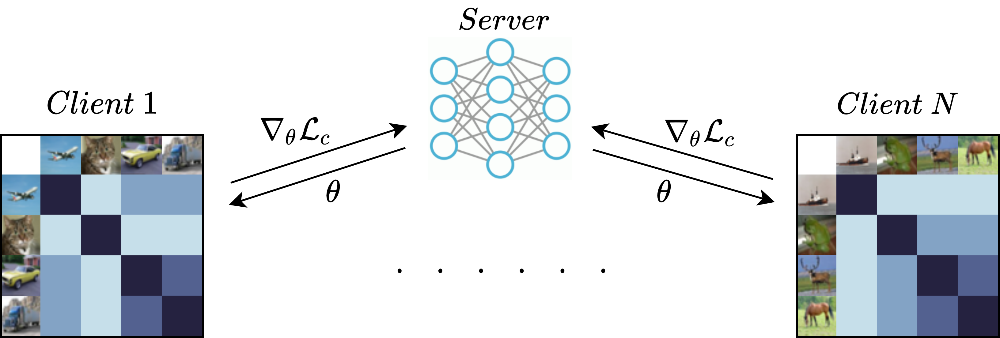

# Personalized Federated Learning with Gaussian Processes
<p align="center"> 
    
</p>
Federated learning aims to learn a global model that performs well on client devices with limited cross-client communication. Personalized federated learning (PFL) further extends this setup to handle data heterogeneity between clients by learning personalized models. A key challenge in this setting, is to learn effectively across clients, even though each client has its unique data, which is often limited in size. Here we put forward a solution to PFL that is based on Gaussian processes (GPs) with deep kernel learning, which we call pFedGP. GP models are highly expressive, and thanks to their Bayesian nature, they work well in the low data regime. However, applying GPs to PFL raises multiple challenges. Mainly, GPs performance depends heavily on access to a good kernel function, and learning a kernel requires a large training set. To address this, we propose learning a single kernel function, parameterized by a neural network, shared by all clients using a personal GP classifier for each client. We further extend pFedGP to include inducing points, using two novel methods. We derive a PAC-Bayes generalization bound on novel clients and empirically show that it gives non-vacuous guarantees. We perform extensive experiments on standard PFL benchmarks as well as a new setup of learning under input noise. We find that pFedGP significantly outperforms baseline methods while achieving well-calibrated predictions.

[[Paper]](https://arxiv.org/abs/2106.15482)
[[Project-Page]](https://idanachituve.github.io/projects/pFedGP/)

### Instructions
Install repo:
```bash
pip install -e .
```

To download noisy CIFAR-10:
```bash
cd experiments/datafolder/noisy_cifar10
python download_noisy_data.py
```

To download noisy CIFAR-100:
```bash
cd experiments/datafolder/noisy_cifar100
python download_noisy_data.py
```

To run pFedGP:
```bash
cd experiments/exp-type/scripts
./pFedGP_model-variant
```
Where, exp-type is either heterogeneous_class_dist, noisy_input, or ood_generalization. And model-variant is either full, IP_compute, or IP_data

### Citation
Please cite this paper if you want to use it in your work,
```
@article{achituve2021personalized,
  title={Personalized Federated Learning with Gaussian Processes},
  author={Achituve, Idan and Shamsian, Aviv and Navon, Aviv and Chechik, Gal and Fetaya, Ethan},
  journal={Advances in Neural Information Processing Systems},
  volume={34},
  year={2021}
}
```

